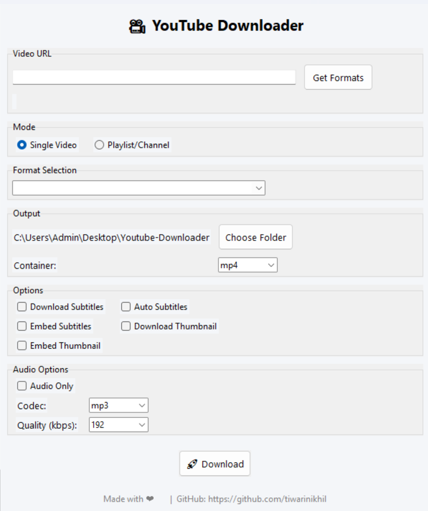

# 🎬 YouTube Downloader

A modern desktop GUI for downloading YouTube **videos** and **playlists** using [yt-dlp](https://github.com/yt-dlp/yt-dlp), built with Python and Tkinter.

---

## ✨ Features
- 🎥 **Single Video or Playlist/Channel** mode (choose from UI).
- 🎚️ **Format selection** (resolution, codec, size).
- 🎧 **Audio only** downloads (MP3, M4A, WAV, Opus, FLAC).
- 📂 **Custom output folder** and container format (MP4, MKV, WEBM).
- 💬 **Subtitles** support (normal, auto, embed).
- 🖼️ **Thumbnail** download & embedding.
- ✅ Clean, modern Tkinter UI with dropdowns, checkboxes, and radio buttons.
- 🖱️ Inline status updates (no popups for format fetch).
- 🔗 Clickable **GitHub credits link**.

---

## 📦 Requirements
- Python **3.8+**
- `yt-dlp` (core downloader)
- `tkinter` (GUI)
- `ttk` (modern themed widgets, comes with tkinter)
- `ffmpeg` (for audio extraction, embedding thumbnails, etc.)

---

## 🛠️ Installation

1. **Clone the repo**
   ```bash
   git clone https://github.com/tiwarinikhil/youtube-downloader.git
   cd yt-dlp-gui
   
2. **Create a virtual environment (optional but recommended)**
	 ```bash
	  python -m venv venv
	  source venv/bin/activate   # On Linux/Mac
	  venv\Scripts\activate      # On Windows

3. ****Install dependencies****
	```bash
	pip install -r requirements.txt

4. ****Install FFmpeg****

- **Download FFmpeg** from [ffmpeg.org](https://ffmpeg.org/download.html)  
- Install it and ensure the `ffmpeg` binary is added to your system **PATH**.  
- Verify installation by running:  

	```bash
	ffmpeg -version


## 🚀 Usage

### Run the app

`python app.py` 

### Workflow

1.  Paste a YouTube URL (video or playlist).
    
2.  Click **Get Formats** → loads available formats.
    
3.  Select mode:
    
    -   **Single Video**
        
    -   **Playlist/Channel**
        
4.  Pick output folder, container, subtitles, thumbnails, or audio options.
    
5.  Click **🚀 Download**.
    

----------

## 🖼️ Screenshots

<p align="center">
  
</p>


----------

## 🔧 Advanced Ideas (Future Improvements)

-   Progress bar with % and speed inside the UI.
    
-   Playlist video picker (preview all videos before download).
    
-   Dark/Light mode themes.
    
-   Multi-URL batch downloads.
    


